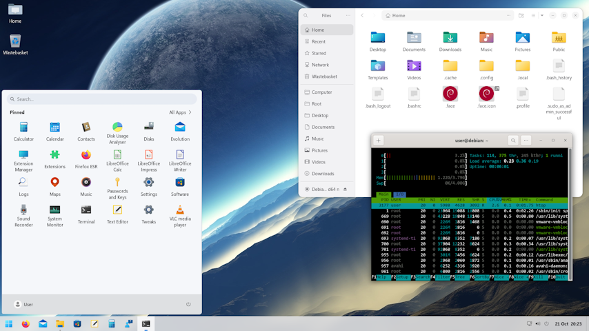

# Debian Trixie → Windows 11 Look (GNOME)

Give Debian **13 “Trixie”** a polished Windows 11 aesthetic with one script: Windows fonts, wallpapers, icon theme, GNOME extensions, and sensible defaults — all applied safely and idempotently.

> **TL;DR**  
> 1) On Windows, run **`Copy Windows Assets.bat`** to export fonts & wallpapers.  
> 2) On Debian, run:
> ```bash
> chmod +x install.sh
> ./install.sh
> ```

## Screenshot



## ✨ What you get

- Windows system & cloud fonts installed system‑wide (Aptos/Segoe/Consolas, etc.).  
- Official Windows 11 wallpapers and automatic light/dark background setup.  
- **Win11** icon theme applied to GNOME.  
- GNOME Tweaks + Extension Manager and a curated set of extensions (Dash‑to‑Panel, ArcMenu, Blur‑my‑Shell, User Theme, DING, Light Style).  
- Quality‑of‑life tweaks: terminal shortcut (**Ctrl+Alt+T**), white‑on‑black GNOME Terminal profile, smaller desktop icons, file chooser shows hidden files, and more.  
- Optional encrypted‑boot visuals (Plymouth/GRUB) with quiet splash and shorter GRUB timeout.  
- A tidy interactive menu so you can run everything at once or pick specific steps.

---

## 📦 Repository layout

```
.
├─ install.sh
├─ Linux/
│  ├─ ArcMenu.dconf
│  ├─ Dash-to-Panel.dconf
│  └─ Win11-icon-theme-main.zip         # (optional, auto-downloaded if missing)
└─ Windows/
   ├─ Fonts/
   │  ├─ Cloud Fonts/
   │  └─ Windows Fonts/
   ├─ Wallpaper/
   └─ User Profile Photo/
      └─ user.png
```

> The **Windows/** folders are populated by your Windows export step below.

---

## 🖼️ Export Windows assets (run on Windows 11)

1. Boot into your Windows 11 install.  
2. Run **`Copy Windows Assets.bat`**.  
   - It collects Microsoft fonts and wallpapers and copies them into the repository under `Windows/Fonts/*` and `Windows/Wallpaper/`.  

---

## 🧰 Base install (Debian 13 “Trixie”)

1. Download the **Debian 13.1.0 netinst** ISO.  
2. Use **Rufus** on Windows to create a bootable USB.  
3. In UEFI/BIOS, boot from the USB.  
4. Create your default user.  
5. During partitioning you may choose: **Guided – use entire disk and set up encrypted LVM** (optional).  
6. At *Software selection*, choose:  
   - **Debian desktop environment**  
   - **GNOME**  
   - **SSH server** *(optional)*  
   - **standard system utilities*.*

> The script checks you’re on **Debian Trixie** and warns if not.

---

## 🚀 Quick start (on Debian)

```bash
# from the repo root
chmod +x install.sh
./install.sh
```

You’ll see an **interactive menu**. Choose **`a`** to run everything in order, or run individual steps as needed.

---

## 🧭 Interactive menu

| No. | Action |
|-----|--------|
| 1 | Add current user (UID 1000) to **passwordless sudo** (via `/etc/sudoers.d` drop‑in, validated by `visudo`). Prompts for root and asks you to reboot if your group membership changes. |
| 2 | GNOME custom shortcut: **Ctrl+Alt+T → gnome-terminal**. |
| 3 | GNOME Terminal: **white on black** colour scheme and sane palette. |
| 4 | **Deb822** sources for Trixie (`/etc/apt/sources.list.d/debian.sources`), then `apt update && apt upgrade`. |
| 5 | Handy apps: `curl`, `firmware-linux`, `firmware-linux-nonfree`, `font-manager`, `git`, `htop`, `nautilus-admin`, `p7zip-full`, `rsync`, `vlc`, `wget`. |
| 6 | Encrypted‑boot visuals: **Plymouth themes** (bgrt), initramfs hook, `GRUB_TIMEOUT=3`, ensure `quiet splash`, then rebuild initramfs & update‑grub. |
| 7 | **Import Windows fonts** into `/usr/local/share/fonts/{WindowsCloud,Windows}` and refresh font cache. |
| 8 | **Install wallpapers** to `/usr/share/backgrounds/Win11` and set GNOME **light** → `img0.jpg`, **dark** → `img19.jpg` (with fallbacks). |
| 9 | **Win11 icon theme**: uses local zip if present or auto‑downloads current `main.zip`; installs system‑wide and applies via `gsettings`. |
| 10 | **User profile photo** via AccountsService (`/var/lib/AccountsService/...`). |
| 11 | Install **GNOME extensions**, Extension Manager, Tweaks; manually installs a recent **ArcMenu** release and enables extensions where possible. |
| 12 | **Custom GNOME settings**: imports ArcMenu & Dash‑to‑Panel `.dconf`, sets fonts (Aptos/Segoe UI Variable/Consolas), cursor, button layout, Nautilus prefs, DING size, GTK file chooser, etc. |

> All steps are **idempotent**; re‑running is safe. The script uses `gsettings`/`dconf` where appropriate and falls back gracefully on headless/TTY sessions.

---

## 🛡️ Notes & safety

- Step **1** changes sudo policy for the `sudo` group using a drop‑in and validates with `visudo`. You will be prompted for the **root** password as required.  
- The script only inserts **`quiet splash`** once and normalises GRUB lines — no duplicate clutter.  
- Fonts are installed under **`/usr/local/share/fonts`**, leaving distro‑managed paths alone.  
- The icon theme installer refreshes caches when needed.  
- Headless sessions skip GNOME‑only bits with helpful warnings.  

---

## 🔧 Troubleshooting

- **Fonts not appearing**: ensure `fontconfig` is installed (`sudo apt install fontconfig`) and re‑run step **7** to refresh the cache.  
- **ArcMenu not visible**: open **Extension Manager** and ensure it’s enabled; log out/in if necessary.  
- **No wallpapers set**: verify the exported images exist under `Windows/Wallpaper/`. Step **8** picks the first/last file as fallbacks if `img0.jpg`/`img19.jpg` aren’t present.  
- **No GNOME session**: steps that require `gsettings`/`dconf` will print warnings and continue.  
- **Reboot prompts**: step **1** asks for a reboot after changing group membership — you must reboot before continuing if prompted.

---

## 🧑‍💻 Developer info

- The script is written for **Debian 13 (Trixie)** and will **warn** on other distros/codenames.  
- Root actions are done with `sudo` or a single `su -c` where `sudo` may not yet exist.  
- Menu accepts arguments for quick‑jump, e.g.:  
  ```bash
  ./install.sh 4 6 7 8 9
  ```

---

## ✅ Licence

This project is provided under the **MIT Licence**.

---

## 🙌 Credits

- **Win11 icon theme** by yeyushengfan258.  
- **ArcMenu**, **Dash‑to‑Panel**, **Blur my Shell**, **DING**, **User Theme**, **Light Style** — respective GNOME extension authors.  
- Microsoft fonts & wallpapers remain property of Microsoft; this script only assists with local backup & installation.

---

## ⭐ Support & contributions

Issues and pull requests are welcome. If you discover a Debian or GNOME change that needs handling, please open an issue with logs and your `install.sh` output (redact anything sensitive).
